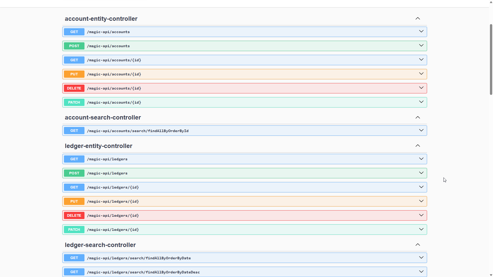

# Backend for Ledger App
## Required
First run edit `src/resource/application.properties`
```
spring.jpa.hibernate.ddl-auto=create
```
else
```
spring.jpa.hibernate.ddl-auto=validate
```

## Progression
- [ ] Swagger for Port 8080

## Screenshot
Swagger
```
http://chonsawat/swagger-ui/index.html
```

